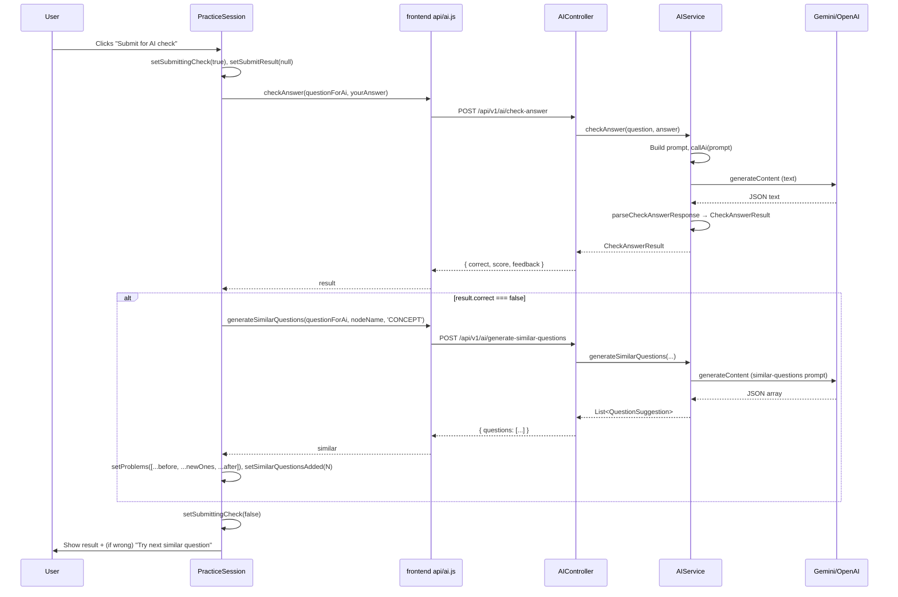

# MasteryPath: AI & Practice — Full Rundown & Code Guide

This document is an in-depth overview of the AI integration and practice flow in MasteryPath: what each piece does, how it’s wired, and where to find it in the code.

---

## 1. High-Level Overview

**What the AI does in MasteryPath**

- **Answer checking** — When a student submits an answer, the AI evaluates it (correct/incorrect, score, feedback).
- **Live feedback** — In “Learning” mode, the AI gives hints and feedback as the student types (debounced).
- **Draw/upload marking** — Handwritten work or uploaded images/PDFs are sent to a **vision** model; the AI transcribes and marks the answer.
- **Similar questions** — When the answer is wrong, the AI generates more questions of the same caliber; the student can only move on when they get one right.
- **Extra practice** — “Generate more questions” uses the AI to add more problems to the current session (optional).
- **Path & course generation** — “Generate with AI” (path selector) and marketplace “Generate AI Course” use the AI to create learning paths or full courses from a description.

**Provider choice**

- If **GEMINI_API_KEY** is set (and loaded at startup), the app uses **Google Gemini** for both text and vision.
- Otherwise it uses **OpenAI** (OPENAI_API_KEY). So you can run with Gemini only (free tier) or OpenAI, or switch by changing env.

**Practice rules (no bypass)**

- Students **cannot** skip by clicking “Success” or “Fail” without the AI. The only way to advance is:
  - Submit an answer for AI check → get **correct** → then “Move to next” (or finish).
- If the answer is **wrong**, the app auto-requests **similar questions** and shows “Try next (similar) question”; advancing still requires getting one right.
- **Resume** — When you open a node again, practice starts at the **next question** after the last one you solved (using your logged success count).

---

## 2. Backend: Configuration & Environment

### 2.1 `application.yml` (Spring config)

**Path:** `backend/src/main/resources/application.yml`

```yaml
ai:
  enabled: true
  openai:
    api-key: ${OPENAI_API_KEY:}
    base-url: ${OPENAI_API_BASE:https://api.openai.com}
    model: ${OPENAI_MODEL:gpt-4o-mini}
  gemini:
    api-key: ${GEMINI_API_KEY:}
    model: ${GEMINI_MODEL:gemini-2.5-flash}
```

- **Gemini** is used when `GEMINI_API_KEY` is non-empty (e.g. from `.env`). Default model is `gemini-2.5-flash` (free-tier friendly: 5 RPM, 250K TPM, 20 RPD).
- **OpenAI** is used when only `OPENAI_API_KEY` is set. Base URL and model are overridable via env.

### 2.2 `.env` and startup

**Path:** `.env` (project root; not committed). Example:

```bash
GEMINI_API_KEY=AIza...
# GEMINI_MODEL=gemini-2.5-flash   # optional override
```

**Path:** `start-all.sh`

Before starting the backend, the script loads `.env` so the Java process sees the keys:

```bash
if [ -f ../.env ]; then
  set -a
  . ../.env
  set +a
  echo "Loaded .env for backend"
fi
mvn spring-boot:run ...
```

So **you must run the app via `./start-all.sh`** (or otherwise source `.env` before starting the backend) for Gemini/OpenAI keys to work.

---

## 3. Backend: AIService (Domain Logic)

**Path:** `backend/src/main/java/com/masterypath/domain/service/AIService.java`

This is the single place that talks to Gemini/OpenAI. All AI features go through here.

### 3.1 Configuration (injected)

```java
@Value("${ai.gemini.api-key:}")     private String geminiApiKey;
@Value("${ai.gemini.model:gemini-2.5-flash}") private String geminiModel;
@Value("${ai.openai.api-key:}")    private String openaiApiKey;
@Value("${ai.openai.base-url:...}") private String openaiBaseUrl;
@Value("${ai.openai.model:gpt-4o-mini}") private String openaiModel;
@Value("${ai.enabled:true}")       private boolean aiEnabled;
```

- `hasAiKey()` — true if at least one of Gemini or OpenAI key is set.
- **Text:** `callAi(prompt)` → if Gemini key set → `callGemini(prompt)`, else `callOpenAI(prompt)`.
- **Vision:** `callAiVision(prompt, base64Image)` → same choice between `callGeminiVision` and `callOpenAIVision`.

### 3.2 Gemini text: `callGemini(String prompt)`

- **URL:** `https://generativelanguage.googleapis.com/v1beta/models/{geminiModel}:generateContent?key={key}`.
- **Body:** `contents[].parts[].text` = prompt; `generationConfig`: temperature 0.7, maxOutputTokens 2000.
- **Response:** Parses `candidates[0].content.parts[0].text` as the model reply.
- **Errors:** On non-2xx, `friendlyAiError(statusCode, body)` turns 429 / quota / RESOURCE_EXHAUSTED into a short user-facing message; otherwise rethrows with full body.

### 3.3 Gemini vision: `callGeminiVision(String prompt, String base64Image)`

- Same base URL and model; body includes both a text part and `inlineData` (mimeType `image/png`, data = base64).
- Used for: **extract text from image**, **mark drawing** (handwritten answer).
- Same friendly error handling as text.

### 3.4 OpenAI text and vision

- **Text:** POST to `{baseUrl}/v1/chat/completions` with `model`, `messages` (system + user), temperature, max_tokens; response from `choices[0].message.content`.
- **Vision:** Uses `gpt-4o` with a message that has both text and `image_url` (data URL with base64). Used when Gemini key is not set.

### 3.5 Friendly error helper

```java
private static String friendlyAiError(int statusCode, String body) {
    if (statusCode == 429) return "AI rate limit reached. Please wait a minute and try again.";
    if (body contains "quota"|"RESOURCE_EXHAUSTED"|"rate limit") return same message;
    if (401 or 403) return "AI API key invalid or not authorized.";
    return null;  // caller uses default/long message
}
```

So users see a clear “rate limit” or “invalid key” message instead of raw JSON.

### 3.6 Main public methods (what the controller calls)

| Method | Purpose |
|--------|--------|
| `generatePath(description, difficulty, estimatedTimeMinutes)` | Path generation from description; returns list of node suggestions (name, description, category). On failure returns default suggestions. |
| `generateQuestions(topic, difficulty, count)` | Generates N practice questions (problem_text, solution_text, difficulty). Throws on parse/API failure so controller can return 500. |
| `generateSimilarQuestions(originalQuestion, topic, errorType)` | Same as above but prompt is “similar questions to this one they got wrong” (errorType e.g. CONCEPT). |
| `extractTextFromImage(byte[])` | Vision: “Extract all text from this image.” Returns transcribed text. |
| `extractTextFromPDF(byte[])` | Uses PDFBox; no AI. |
| `markDrawing(byte[] imageData, String question)` | Vision: “Mark this handwritten answer for this question.” Returns `MarkingResult(score, feedback, extractedText)`. |
| `checkAnswer(question, answer)` | Text: “Evaluate this student answer.” Returns `CheckAnswerResult(correct, score, feedback)`. Parses JSON `{correct, score, feedback}` from model. |
| `getLiveFeedback(question, answer)` | Text: “Give 1–3 short hints, don’t give the answer.” Returns raw string. |

### 3.7 Prompts (summary)

- **Path:** “Generate a structured learning path… Return a JSON array of nodes with name, description, category.”
- **Questions:** “Generate N practice questions for topic X. Return JSON array with problem_text, solution_text, difficulty.”
- **Similar:** “User got this wrong: … Topic: … Error type: … Generate 3 similar questions. Return JSON array…”
- **Check answer:** “You are a teacher. Evaluate this answer. Return ONLY JSON: {correct, score, feedback}.”
- **Live feedback:** “You are a tutor. Give 1–3 short hints. Do NOT give the full answer.”
- **Mark drawing:** “You are a teacher. Transcribe handwritten text, evaluate, score 0–100, give feedback. Return JSON: {extractedText, score, feedback}.”

All JSON is extracted from the model reply (e.g. `extractJsonArray` / `extractJsonObject`) so markdown or extra text around the JSON is tolerated.

---

## 4. Backend: AIController (HTTP API)

**Path:** `backend/src/main/java/com/masterypath/api/ai/AIController.java`

- **Base path:** `@RequestMapping("/api/v1/ai")`.
- Every endpoint checks **session** via `getCurrentUser(httpRequest)`; if null, returns 401 “Not authenticated”.

| Endpoint | Method | Body / Params | Returns |
|----------|--------|----------------|--------|
| `/generate-path` | POST | JSON: description, difficulty, estimatedTimeMinutes | `{ suggestions: [{ name, description, category }] }` |
| `/generate-questions` | POST | JSON: topic, difficulty, count | `{ questions: [{ problemText, solutionText, difficulty }] }` |
| `/generate-similar-questions` | POST | JSON: originalQuestion, topic, errorType | same as above |
| `/extract-text` | POST | multipart: `file` (PDF or image) | `{ extractedText }` |
| `/mark-drawing` | POST | multipart: `image`, `question` | `{ score, feedback, extractedText }` |
| `/check-answer` | POST | JSON: question, answer | `{ correct, score, feedback }` |
| `/live-feedback` | POST | JSON: question, answer | `{ feedback }` |

Errors return `{ "error": "..." }` with a suitable status code (400/500). The backend already uses `friendlyAiError` in AIService so messages like “Failed to check answer: AI rate limit reached…” are what the frontend receives.

---

## 5. Frontend: AI API Client

**Path:** `frontend/src/api/ai.js`

- **Base URL:** `const API_BASE = '/api/v1'` (same-origin; Vite proxy or backend serves frontend).
- All requests use `credentials: 'include'` so the session cookie is sent.

**Exported functions:**

- `generatePath(description, difficulty, estimatedTimeMinutes)` → POST `/ai/generate-path`.
- `generateQuestions(topic, difficulty, count)` → POST `/ai/generate-questions`; on !ok uses `friendlyAiError(status, msg)` and throws.
- `generateSimilarQuestions(originalQuestion, topic, errorType)` → POST `/ai/generate-similar-questions`; same error handling.
- `extractTextFromFile(file)` → POST `/ai/extract-text` (FormData with `file`).
- `markDrawing(question, imageBlob)` → POST `/ai/mark-drawing` (FormData: `image`, `question`); uses `friendlyAiError`.
- `checkAnswer(question, answer)` → POST `/ai/check-answer`; uses `friendlyAiError`.
- `getLiveFeedback(question, answer)` → POST `/ai/live-feedback`; uses `friendlyAiError`.

**`friendlyAiError(status, message)` (frontend):**

- If `status === 429` or message (lowercased) contains “quota”, “rate limit”, “resource_exhausted” → return `"AI rate limit reached. Please wait a minute and try again."`.
- Otherwise return `null` so the caller throws the original `msg`. This avoids showing long JSON error bodies to the user.

---

## 6. Practice Session Flow (Frontend)

**Path:** `frontend/src/components/Practice/PracticeSession.jsx`

This is where “everything” comes together: resume, AI check, similar questions, and “move on only when correct.”

### 6.1 Loading problems and resuming

- **Effect (nodeId):** Runs `Promise.all([getProblemsForNode(nodeId), getNodeLogs(nodeId).catch(() => [])])`.
- **Problems:** `setProblems(list)`.
- **Resume index:** `successCount = logs.filter(l => l.success).length`; then `startIndex = min(successCount, list.length - 1)`; `setCurrentProblemIndex(startIndex)`.
- So when you open a node again, you start at the **next question** after the last one you solved (or at the last problem if you’ve solved them all).

### 6.2 Answer area and modes

- **Learning** — `aiMode === 'learning'`: debounced (800 ms) call to `getLiveFeedback(questionForAi, yourAnswer)`; result shown as “Live AI feedback”.
- **Submit** — `aiMode === 'submit'`: user types (or draws/uploads); clicks “Submit for AI check” → `handleSubmitForCheck`.

### 6.3 Submit for AI check and similar questions

- `handleSubmitForCheck`:
  - Calls `checkAnswer(questionForAi, yourAnswer)` → `setSubmitResult(result)`.
  - If `result.correct === false`:
    - Calls `generateSimilarQuestions(questionForAi, nodeName, 'CONCEPT')`.
    - Maps response to `{ problemText, solutionText, difficulty }` and **inserts** them right after the current problem: `setProblems(prev => [...before, ...newOnes, ...after])`.
    - Sets `similarQuestionsAdded` so the UI can say “We added N similar questions.”
  - So a wrong answer automatically adds follow-up questions of the same caliber; the student can retry or “Try next (similar) question.”

### 6.4 Moving on (only when correct)

- **When `submitResult?.correct === true`:** Bottom section shows “Correct! Move on when ready” and a single button **“Move to next”** → `handleSuccess()` (logs success, then either `setCurrentProblemIndex(currentProblemIndex + 1)` or `onComplete(...)`).
- **When `submitResult?.correct === false`:** Section shows “Get one right to move on”, message about similar questions, and **“Try next (similar) question”** (advances index so the next problem in the list is shown). No “Success”/“Fail” that would let them skip.
- **When `submitResult === null`:** Only the line “Submit your answer above for AI check. You can move on when you get it right.” So there is no way to advance without submitting and getting correct.

So the only way to “move on” is: **Submit for AI check → correct → Move to next.**

### 6.5 Generate more questions (extra practice)

- Button “✨ Generate more questions” calls `generateQuestions(nodeName, 'intermediate', 3)` and **appends** the returned questions to `problems` (does not change the “move on only when correct” rule).
- Label: “Extra practice (optional)”. It only adds more problems; advancement is still gated by getting a question right.

### 6.6 Draw and upload

- **Draw:** Opens `DrawingCanvas`; user draws; canvas is sent as image blob to `markDrawing(question, imageBlob)`. Result (score, feedback, extractedText) can be used to show success/fail (or prefill text).
- **Upload:** Opens `FileUploadModal`; file is sent to `extractTextFromFile` (or extract-text endpoint); for images, backend uses vision to transcribe. Extracted text can be used to prefill the answer area.

---

## 7. Flow Diagrams

The following Mermaid diagrams summarize the main flows. They render in GitHub, VS Code (with a Mermaid extension), and many other Markdown viewers.

### 7.1 Practice session: from open to move-on

```mermaid
flowchart TD
    subgraph Open["Open practice (node clicked)"]
        A[Load nodeId] --> B[Promise.all: getProblemsForNode + getNodeLogs]
        B --> C[setProblems(list)]
        B --> D[successCount = logs.filter(success).length]
        D --> E[startIndex = min(successCount, list.length-1)]
        E --> F[setCurrentProblemIndex(startIndex)]
    end
    subgraph Answer["Answer & submit"]
        G[Show problem at currentProblemIndex] --> H{Mode?}
        H -->|Learning| I[Debounced getLiveFeedback]
        H -->|Submit| J[User clicks Submit for AI check]
        J --> K[checkAnswer(question, yourAnswer)]
    end
    subgraph Result["After check"]
        K --> L{result.correct?}
        L -->|true| M[Show Move to next]
        M --> N[User clicks → handleSuccess → log + advance or complete]
        L -->|false| O[generateSimilarQuestions]
        O --> P[Insert new questions after current]
        P --> Q[Show Try next similar question]
        Q --> R[User retries or tries next until correct]
        R --> N
    end
    Open --> Answer
    Answer --> Result
```

### 7.2 AI provider selection (backend)

```mermaid
flowchart LR
    A[callAi(prompt) or callAiVision(prompt, image)] --> B{GEMINI_API_KEY set?}
    B -->|yes| C[callGemini / callGeminiVision]
    B -->|no| D{OPENAI_API_KEY set?}
    D -->|yes| E[callOpenAI / callOpenAIVision]
    D -->|no| F[Throw: No AI key configured]
    C --> G[generativelanguage.googleapis.com]
    E --> H[openai base URL]
```

### 7.3 Submit-for-check and similar-questions flow



### 7.4 Backend: HTTP request to AI response

```mermaid
flowchart TD
    subgraph Frontend
        F1[User action] --> F2[fetch POST /api/v1/ai/...]
    end
    subgraph Backend
        F2 --> R[AIController endpoint]
        R --> A1{Authenticated?}
        A1 -->|no| R401[401 Not authenticated]
        A1 -->|yes| S[AIService method]
        S --> A2{Text or Vision?}
        A2 -->|Text| S1[callAi(prompt)]
        A2 -->|Vision| S2[callAiVision(prompt, base64)]
        S1 --> A3{Which provider?}
        S2 --> A3
        A3 -->|Gemini| G[callGemini / callGeminiVision]
        A3 -->|OpenAI| O[callOpenAI / callOpenAIVision]
        G --> HTTP1[POST generativelanguage.googleapis.com]
        O --> HTTP2[POST openai base URL]
        HTTP1 --> PARSE1[Parse candidates[0].content.parts[0].text]
        HTTP2 --> PARSE2[Parse choices[0].message.content]
        PARSE1 --> OUT[Return string / parse to DTO]
        PARSE2 --> OUT
        OUT --> R200[200 OK + JSON body]
    end
    R200 --> F2
```

---

## 8. Code Deep Dives

Targeted walkthroughs of specific code paths, with file paths and line references.

### 8.1 Resume at “last question” (start index)

**File:** `frontend/src/components/Practice/PracticeSession.jsx`  
**Lines:** 62–84 (effect when `nodeId` changes)

**What it does:** When you open practice for a node, the app loads both the problem list and your history for that node. It sets the initial problem index so you land on the **next** question after the last one you solved.

**Code:**

```javascript
useEffect(() => {
  if (nodeId == null) { setLoadingProblems(false); setError('No skill selected.'); return; }
  setLoadingProblems(true);
  setError('');
  Promise.all([getProblemsForNode(nodeId), getNodeLogs(nodeId).catch(() => [])])
    .then(([probs, logs]) => {
      const list = Array.isArray(probs) ? probs : [];
      setProblems(list);
      const successCount = Array.isArray(logs) ? logs.filter((l) => l.success).length : 0;
      const startIndex = list.length === 0 ? 0 : Math.min(successCount, list.length - 1);
      setCurrentProblemIndex(startIndex);
      setLoadingProblems(false);
    })
    .catch(err => { /* set error, clear problems */ });
}, [nodeId]);
```

**Why it works:**

- `getNodeLogs(nodeId)` returns performance logs for this node (each log = one attempt; `success` = true/false).
- `successCount` = number of successful attempts = number of problems you’ve solved for this node.
- We want to start at the **next** problem: index `successCount`. If you’ve solved 3, start at index 3 (4th problem).
- `Math.min(successCount, list.length - 1)` caps at the last problem so we never set an index past the end (e.g. 8 problems, 10 successes → start at 7).
- If logs fail, `.catch(() => [])` yields `successCount = 0`, so we still start at 0.

---

### 8.2 Submit for check + auto similar questions

**File:** `frontend/src/components/Practice/PracticeSession.jsx`  
**Lines:** 107–149 (`handleSubmitForCheck`)

**What it does:** On “Submit for AI check” it (1) calls the backend to check the answer, (2) if the result is wrong, requests similar questions and **inserts** them right after the current problem so the student can try again or “Try next (similar) question” without losing place.

**Code (simplified):**

```javascript
const handleSubmitForCheck = useCallback(async () => {
  if (!yourAnswer.trim()) { setError('Enter an answer before submitting.'); return; }
  setSubmittingCheck(true);
  setError('');
  setSubmitResult(null);
  setSimilarQuestionsAdded(0);
  try {
    const result = await checkAnswer(questionForAi, yourAnswer);
    setSubmitResult(result);
    if (result && result.correct === false) {
      setGeneratingSimilar(true);
      try {
        const similar = await generateSimilarQuestions(questionForAi, nodeName, 'CONCEPT');
        const list = similar?.questions;
        if (list && list.length > 0) {
          const newOnes = list.map(q => ({
            problemText: q.problemText ?? q.problem_text,
            solutionText: q.solutionText ?? q.solution_text ?? '',
            difficulty: q.difficulty ?? difficultyNum
          }));
          setProblems(prev => {
            const arr = Array.isArray(prev) ? prev : [];
            const before = arr.slice(0, currentProblemIndex + 1);
            const after = arr.slice(currentProblemIndex + 1);
            return [...before, ...newOnes, ...after];
          });
          setSimilarQuestionsAdded(newOnes.length);
        }
      } catch (e) { setError(e.message || '...'); }
      finally { setGeneratingSimilar(false); }
    }
  } catch (err) { setError(err.message || 'Failed to check answer'); }
  finally { setSubmittingCheck(false);
}, [questionForAi, yourAnswer, nodeName, currentProblemIndex, difficultyNum]);
```

**Insert logic:**

- `before = prev.slice(0, currentProblemIndex + 1)` = everything up to and including the **current** problem.
- `after = prev.slice(currentProblemIndex + 1)` = all later problems.
- New list = `before` + `newOnes` + `after`. So the similar questions appear **immediately after** the one they just got wrong; “Try next (similar) question” then advances `currentProblemIndex` by 1 and shows the first similar question.

---

### 8.3 Backend: `callGemini` (text)

**File:** `backend/src/main/java/com/masterypath/domain/service/AIService.java`  
**Lines:** 392–422

**What it does:** Sends a single text prompt to the Gemini `generateContent` API and returns the model’s text reply. On non-2xx or quota/rate-limit, it throws a user-friendly message when possible.

**Code:**

```java
private String callGemini(String prompt) {
    String url = "https://generativelanguage.googleapis.com/v1beta/models/" + geminiModel + ":generateContent?key=" + geminiApiKey;
    HttpHeaders headers = new HttpHeaders();
    headers.setContentType(MediaType.APPLICATION_JSON);

    Map<String, Object> contents = new HashMap<>();
    contents.put("parts", List.of(Map.of("text", prompt != null ? prompt : "")));
    Map<String, Object> body = new HashMap<>();
    body.put("contents", List.of(contents));
    Map<String, Object> genConfig = new HashMap<>();
    genConfig.put("temperature", 0.7);
    genConfig.put("maxOutputTokens", 2000);
    body.put("generationConfig", genConfig);

    HttpEntity<Map<String, Object>> request = new HttpEntity<>(body, headers);
    ResponseEntity<String> response = restTemplate.postForEntity(url, request, String.class);

    if (!response.getStatusCode().is2xxSuccessful()) {
        String friendly = friendlyAiError(response.getStatusCode().value(), response.getBody());
        throw new RuntimeException(friendly != null ? friendly : "Gemini API error: " + ...);
    }
    try {
        JsonNode json = objectMapper.readTree(response.getBody());
        JsonNode candidates = json.get("candidates");
        if (candidates == null || !candidates.isArray() || candidates.isEmpty())
            throw new RuntimeException("Gemini returned no candidates");
        return candidates.get(0).get("content").get("parts").get(0).get("text").asText();
    } catch (Exception e) {
        throw new RuntimeException("Failed to parse Gemini response", e);
    }
}
```

**Details:**

- **URL:** Gemini v1beta `generateContent`; model and API key come from `@Value` (e.g. `gemini-2.5-flash`).
- **Request body:** `contents` is a list of one item with `parts: [{ text: prompt }]`; `generationConfig` sets temperature and max tokens.
- **Error handling:** Before throwing, `friendlyAiError(statusCode, body)` checks for 429 or body containing "quota"/"RESOURCE_EXHAUSTED"/"rate limit" and returns a short message so the controller can send it to the client.
- **Response:** Gemini returns `candidates[0].content.parts[0].text`; we parse the JSON and return that string (the rest of the app then parses JSON from that string where needed, e.g. check-answer).

---

### 8.4 Backend: parsing check-answer response

**File:** `backend/src/main/java/com/masterypath/domain/service/AIService.java`  
**Lines:** 321–331 (`parseCheckAnswerResponse`), 246–254 (`extractJsonObject` used inside)

**What it does:** The model is asked to return **only** a JSON object `{ "correct": boolean, "score": 0-100, "feedback": "..." }`. This method extracts that object from the raw reply (which may contain markdown or extra text) and maps it to `CheckAnswerResult`.

**Code:**

```java
private CheckAnswerResult parseCheckAnswerResponse(String response) {
    try {
        String jsonStr = extractJsonObject(response);  // finds first { ... last }
        JsonNode json = objectMapper.readTree(jsonStr);
        boolean correct = json.has("correct") && json.get("correct").asBoolean();
        int score = json.has("score") ? json.get("score").asInt() : 0;
        String feedback = json.has("feedback") ? json.get("feedback").asText() : "No feedback.";
        return new CheckAnswerResult(correct, score, feedback);
    } catch (Exception e) {
        return new CheckAnswerResult(false, 0, "Could not parse AI response.");
    }
}
```

**`extractJsonObject`:** Finds the first `{` and last `}` in `response` and returns that substring, so we tolerate surrounding text or markdown code fences.

**Why safe:** If the model returns malformed JSON or wrong shape, we catch and return `(correct: false, score: 0, feedback: "Could not parse AI response.")` so the UI still shows a clear state instead of crashing.

---

### 8.5 Backend: `friendlyAiError`

**File:** `backend/src/main/java/com/masterypath/domain/service/AIService.java`  
**Lines:** 424–433

**What it does:** Centralizes user-facing messages for known AI provider failures so the API doesn’t return long JSON error bodies to the frontend.

**Code:**

```java
private static String friendlyAiError(int statusCode, String body) {
    if (statusCode == 429) return "AI rate limit reached. Please wait a minute and try again.";
    String b = body != null ? body : "";
    if (b.contains("quota") || b.contains("RESOURCE_EXHAUSTED") || b.contains("rate limit"))
        return "AI rate limit reached. Please wait a minute and try again.";
    if (statusCode == 401 || statusCode == 403) return "AI API key invalid or not authorized.";
    return null;
}
```

**Usage:** Both `callGemini` and `callGeminiVision` call this when `!response.getStatusCode().is2xxSuccessful()`. If it returns non-null, we throw with that message; otherwise we throw with the full API error string. The controller then sends `"Failed to check answer: " + e.getMessage()` (or similar) to the client, so the user sees the short message. The frontend also has its own `friendlyAiError` in `api/ai.js` to map 429/quota in the response body to the same message if the backend ever sent the long string.

---

### 8.6 Frontend: friendly error for AI calls

**File:** `frontend/src/api/ai.js`  
**Lines:** 93–100 (`friendlyAiError`), used in `checkAnswer`, `generateQuestions`, `generateSimilarQuestions`, `markDrawing`, `getLiveFeedback`

**What it does:** Ensures 429 or quota-related errors from the backend are shown as a single sentence instead of a long JSON blob.

**Code:**

```javascript
function friendlyAiError(status, message) {
  if (status === 429) return 'AI rate limit reached. Please wait a minute and try again.';
  const m = (message || '').toLowerCase();
  if (m.includes('quota') || m.includes('rate limit') || m.includes('resource_exhausted'))
    return 'AI rate limit reached. Please wait a minute and try again.';
  return null;
}
```

**Usage:** After `response.json()` (or try/catch around it), we do `const friendly = friendlyAiError(response.status, data.error); throw new Error(friendly || msg);`. So even if the backend returns a long "Failed to check: 429 ... { ... }", the user sees only the short message.

---

## 9. Where Things Live (Quick Reference)

| What | Where |
|------|--------|
| AI config (Gemini/OpenAI keys, models) | `application.yml` + `.env` |
| Load .env for backend | `start-all.sh` (source `.env` before `mvn spring-boot:run`) |
| All AI calls (text + vision) | `AIService.java` |
| HTTP API for AI | `AIController.java` under `/api/v1/ai` |
| Frontend AI client + friendly errors | `frontend/src/api/ai.js` |
| Practice UI, resume, submit, similar, move-on logic | `frontend/src/components/Practice/PracticeSession.jsx` |
| Draw canvas → mark drawing | `DrawingCanvas.jsx` + `markDrawing` in `ai.js` |
| Upload file → extract text | `FileUploadModal.jsx` + `extractTextFromFile` |
| Node logs (for resume index) | `getNodeLogs(nodeId)` from `api/history.js`, backend `GET /api/v1/logs/node/{nodeId}` |

---

## 10. End-to-End User Flows (Recap)

1. **Start practice on a node**  
   Problems load; logs load; `currentProblemIndex` is set to “next unsolved” (resume).

2. **Answer and submit**  
   User types (or draws/uploads). Clicks “Submit for AI check” → backend `checkAnswer` → frontend gets `{ correct, score, feedback }`.

3. **If correct**  
   “Correct! Move on when ready” and “Move to next” appear; clicking logs success and advances (or completes session). No Success/Fail bypass.

4. **If wrong**  
   Backend is asked for similar questions; they’re inserted after the current problem. UI says “Get one right to move on” and offers “Try next (similar) question.” Student keeps trying until they get one right, then can move on.

5. **Optional**  
   “Generate more questions” adds more problems. Same rule: advance only when the AI says the answer is correct.

6. **Learning mode**  
   As they type, debounced `getLiveFeedback` shows hints without giving the answer; submission and move-on rules are unchanged.

This is the full rundown and in-depth code explanation for the AI stuff and practice flow in MasteryPath.
